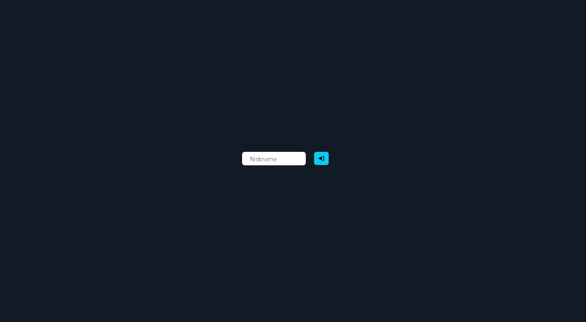

# ChatMe

A modern real-time chat application built with Angular and Node.js.

## Overview

ChatMe is a full-stack chat application that provides real-time messaging capabilities. The project consists of two main components:
- Frontend: Angular-based client application
- Backend: Node.js server with real-time communication capabilities

## Features

- Real-time messaging
- Modern and responsive UI
- Docker support for easy deployment
- TypeScript for type safety
- ESLint and Prettier for code quality

## Prerequisites

- Node.js (v14 or higher)
- Yarn package manager
- Docker (optional, for containerized deployment)

## Installation

1. Clone the repository:
```bash
git clone https://github.com/fadihanna123/chatMe.git
cd chatMe
```

2. Install dependencies:
```bash
yarn setup
```

## Development

To start the development servers for both client and server:

```bash
yarn dev
```

This will concurrently run:
- Frontend server (Angular)
- Backend server (Node.js)

## Available Scripts

- `yarn setup` - Install all dependencies for both client and server
- `yarn dev` - Start development servers
- `yarn seed` - Seed the database with initial data
- `yarn clear` - Clean up node_modules and clear cache

## Docker Deployment

The project includes Docker support for both client and server. To run the application using Docker:

```bash
docker-compose up
```

## Project Structure

```
chatMe/
├── client/           # Angular frontend application
├── server/           # Node.js backend server
├── .github/          # GitHub configuration
├── .vscode/          # VS Code settings
├── docker-compose.yaml
└── package.json      # Root package.json with workspace scripts
```

## Contributing

1. Fork the repository
2. Create your feature branch (`git checkout -b feature/amazing-feature`)
3. Commit your changes (`git commit -m 'Add some amazing feature'`)
4. Push to the branch (`git push origin feature/amazing-feature`)
5. Open a Pull Request

## License

This project is licensed under the MIT License - see the [LICENSE](LICENSE) file for details.

## Screenshot


## Author

- Fadi Hanna - [GitHub](https://github.com/fadihanna123)
